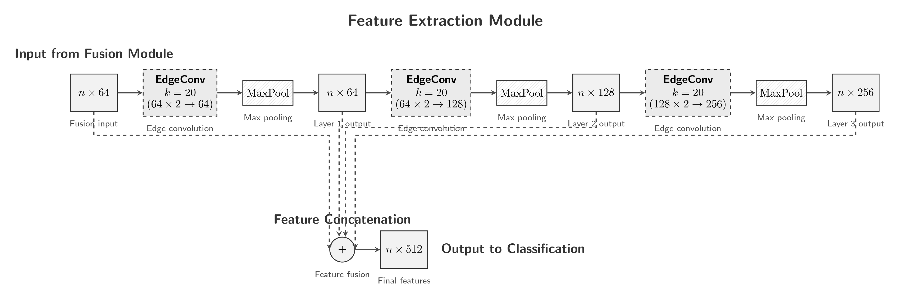

### MS-DGCNN++: A Multi-Scale Fusion Dynamic Graph Neural Network with Biological Knowledge Integration for LiDAR Tree Species Classification

📄 **Preprint on arXiv:** [arXiv:2507.12602](https://arxiv.org/abs/2507.12602)

## Overview

MS-DGCNN++ is a hierarchical multiscale fusion dynamic graph convolutional network designed for tree species classification from terrestrial LiDAR point clouds. Unlike existing approaches that use parallel multi-scale processing, our method employs semantically meaningful feature extraction at local, branch, and canopy scales with cross-scale information propagation.


<div align="center">

</div>
<div align="center">

</div>
<div align="center">

</div>

## Key Features

- **Hierarchical Multi-Scale Processing**: Semantic feature extraction at local, branch, and canopy scales
- **Biological Knowledge Integration**: Architecture aligned with natural tree structure
- **Cross-Scale Information Propagation**: Enhanced feature fusion across different scales
- **Scale-Specific Feature Engineering**: 
  - Standard geometric features for local scale
  - Normalized relative vectors for branch scale
  - Distance information for canopy scale

## Environment Requirements

This implementation is tested on:
- **OS**: Ubuntu 22.04 LTS
- **Python**: 3.8+
- **PyTorch**: 2.4.1
- **CUDA**: 11.8

## Installation

### 1. Clone the Repository

```bash
git clone https://github.com/your-username/MS-DGCNN-plus-plus.git
cd MS-DGCNN-plus-plus
```

### 2. Install Dependencies

```bash
pip install -r requirements.txt
```

### 3. Setup Custom Operations for Baseline MS-DGCNN

For the baseline MS-DGCNN functionality, you need to install additional modules for Farthest Point Sampling (FPS) from the Pointnet++ custom operations:

```bash
# Install custom ops from Pointnet2_PyTorch
git clone https://github.com/erikwijmans/Pointnet2_PyTorch.git
cd Pointnet2_PyTorch
pip install -e .
```

For more information, visit: [Pointnet2_PyTorch Repository](https://github.com/erikwijmans/Pointnet2_PyTorch/tree/master)

## Dataset

### STPCTLS Data

The current repository uses the STPCTLS dataset. Preprocessed data is available in H5 format in the `data_tree` folder.

<div align="center">

</div>

### Data Information

```bash
# Get dataset information
python data.py
```

### Data Visualization

```bash
# Visualize the dataset
python tree_visualizer.py
```

## Usage

### Quick Test with Pretrained Model

Test the model using pretrained weights with preprocessed data:

```bash
python test.py
```

### Training

Train the MS-DGCNN++ model:

```bash
python train.py --model MS_DGCNN2
```

### Data Preprocessing

To preprocess STPCTLS data yourself:

1. Download the raw data from the official source: https://data.goettingen-research-online.de/dataset.xhtml?persistentId=doi:10.25625/FOHUJM
2. Organize data files (xyz, pts, txt) of each class in separate folders named by class
3. Place all class folders in the `data_tree` directory
4. To prepare h5 files run:
  ```bash
python data.py 
```

```bash
# Structure should be:
# data_tree/
# ├── class1/
# │   ├── sample1.xyz
# │   ├── sample1.pts
# │   └── sample1.txt
# └── class2/
#     ├── sample2.xyz
#     ├── sample2.pts
#     └── sample2.txt
```

Using this structure, the script could be adapted to any other 3D point cloud classification dataset.

## Results

### STPCTLS Dataset
#### MS-DGCNN++ performance with different k-NN configurations
<div align="center">

</div>


#### Comparison with other 3D point cloud models 
<div align="center">

</div>

<div align="center">

</div>

### XFOR-Species20K Dataset

<div align="center">

</div>

<div align="center">

</div>


### ModelNet10/40 Dataset
For general 3D point cloud classification benchmarks, MS-DGCNN++ outperforms DGCNN and MS-DGCNN, and achieves competitive results with transformer-based models.
<div align="center">

</div>

## Project Structure

```
MS-DGCNN-plus-plus/
├── data_tree/              # Dataset directory
├── media/                  # Images and visualization
├── models/                 # Model architectures
├── utils/                  # Utility functions
├── data.py                 # Data information script
├── tree_visualizer.py      # Visualization script
├── test.py                 # Testing script
├── train.py                # Training script
├── requirements.txt        # Python dependencies
└── README.md              # This file
```

## Citation

If you find this work useful for your research, please cite:

```bibtex
@article{ohamouddou2025msdgcnn,
  title={MS-DGCNN++: A Multi-Scale Fusion Dynamic Graph Neural Network with Biological Knowledge Integration for LiDAR Tree Species Classification},
  author={Ohamouddou, Said and El Afia, Abdellatif and El Afia, Hanaa and Chiheb, Raddouane},
  journal={arXiv preprint arXiv:2507.12602},
  year={2025}
}
```

## Acknowledgments

This code is based on the excellent implementation of DGCNN: [https://github.com/antao97/dgcnn.pytorch](https://github.com/antao97/dgcnn.pytorch)

## License

This project is licensed under the MIT License - see the [LICENSE](LICENSE) file for details.
